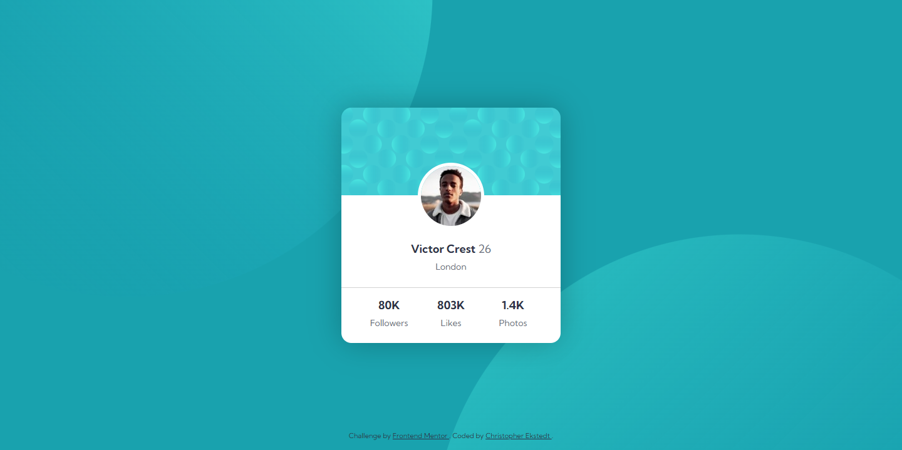
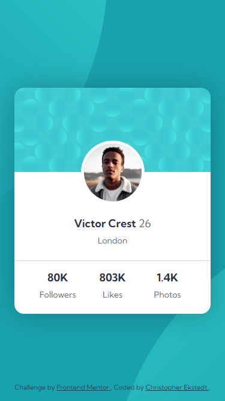

# Frontend Mentor - Profile card component solution

This is a solution to the [Profile card component challenge on Frontend Mentor](https://www.frontendmentor.io/challenges/profile-card-component-cfArpWshJ). Frontend Mentor challenges help you improve your coding skills by building realistic projects.

## Table of contents

- [Overview](#overview)
  - [The challenge](#the-challenge)
  - [Screenshot](#screenshot)
  - [Links](#links)
- [My process](#my-process)
  - [Built with](#built-with)
  - [How to install and run](#how-to-install-and-run)
- [Author](#author)

## Overview

### The challenge

- Build out the project to the designs provided

### Screenshot




### Links

- Solution URL: [Github](https://github.com/cekstedt/FEM-Profile-Card-Component)
- Live Site URL: [Netlify](https://illustrious-gnome-c6eb70.netlify.app/)
- Challenge URL: [Frontend Mentor](https://www.frontendmentor.io/challenges/profile-card-component-cfArpWshJ)

## My process

### Built with

- Semantic HTML5 markup
- Object Oriented Sass (OOSCSS)

### How to install and run

Make sure you have node.js installed.
```
node -v
```

Clone into the repo.
```
git clone https://github.com/cekstedt/FEM-Profile-Card-Component.git
```

Navigate into the root project folder and install developer dependencies (task runners).
```
cd FEM-Profile-Card-Component/
npm install
```
#### Commands

- `npm run start` will start your development server at http://localhost:3000/.
- `npm run build-dist` will create your production-ready `dist` directory.
- `npm run clean` will remove any temporary files.

## Author

- Frontend Mentor - [@cekstedt](https://www.frontendmentor.io/profile/cekstedt)
